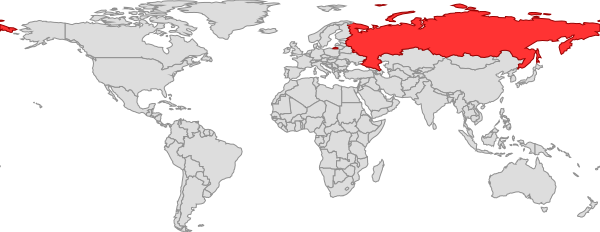

# Features

Reads vector format map polygons and renders into to a bitmap file

- Automatically detect minimal bounding box
  - Adjustable margin as a percentage
- Selectable colors
- Selectable outline stroke

# Usage

```
map-image-preview v1.5.0

Usage: node map-image-preview <options> [mapfile]

mapfile    GeoJSON map source file for the preview

Options:
   -W  --width [0..]         Set the output image width in pixels
   -L  --strokeWidth [0.0..] Set the outline line width in pixels
   -S  --strokeColor #222    Set the outline color (hex code)
   -F  --fillColor #f84      Set the fill color (hex code)
   -B  --bboxscale [0.0..]   Set the bounding box scaling factor, 1.1 = 10% margin
   -M  --meta [file.json]    Optional file containing map layer colors
   -CP --colorProperty [key] GeoJSON property to use for color lookup.  Metadata must have keys with same name.
   -O  --output [file]       Filename of output files, file extension will be added.
```

## Example

```bash
node map-image-preview.js --width 600 --strokeColor "rgba(0,0,255,0.7)" \
  --fillColor "#ff6" --strokeWidth 0.5 example/world.geojson
```


## Arguments

### Color property

```
node map-image-preview.js --width 600 --colorProperty admin \
  --meta example/world.json example/world.geojson
```



### Scale factor

The default scale factor of 1 will fit the map data precisely inside the target raster.

#### Scale factor 120%

```bash
npx map-image-preview --bboxscale 0.8 --width 300 example/world.geojson
```


#### Scale factor 80%

```bash
npx map-image-preview --bboxscale 0.8 --width 300 example/world.geojson
```


### Metafile

Optionally a metadata json file can be used to specify colors to be used in the map. To use this the GeoJSON currently must have a property named "kode", matching with the "kode" value set in the accompanying `meta.json` file.

```bash
npx map-image-preview --meta meta.json example/world.geojson
```

#### Format

```json
{
  "barn": [
    { "kode": "water", "farge": "#00f" },
    { "kode": "land", "farge": "#0f0" }
  ]
}
```

## Composing background map

The app [wms-save-image](https://github.com/Artsdatabanken/wms-save-image) may be used to download background maps from any WMS server for use in combination with images from this program. It will read the generated JSON file.

### Compose single image

Using convert program from Imagemagick to composite the images. To install Imagemagick:

```bash
sudo apt install imagemagick
```

To compose images:

```bash
convert thumbnail_back.png thumbnail.32633.png -compose Multiply -composite thumbnail.png
```


### Compose images recursively

```bash
find . -type d -exec sh -c "cd \"{}\" && pwd && \
  [ -f thumbnail.json ] && \
  convert thumbnail_back.png thumbnail.32633.png -compose Multiply -composite thumbnail.png" \;
```
